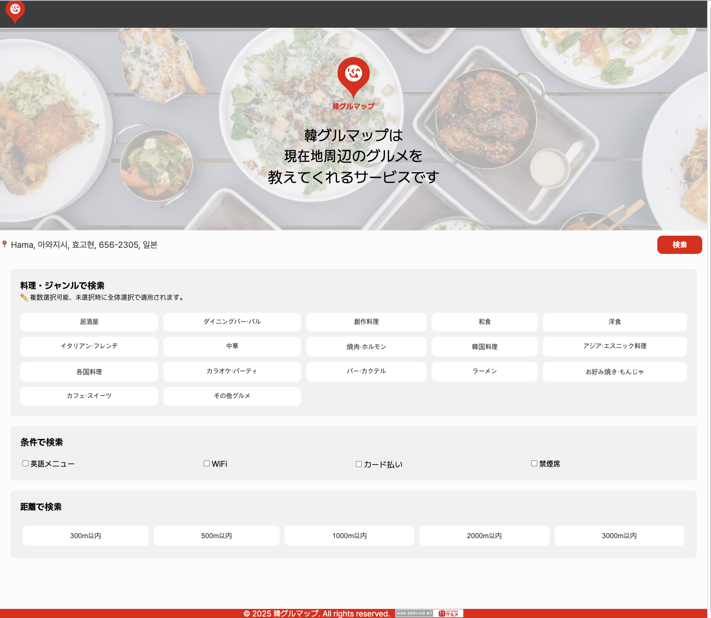
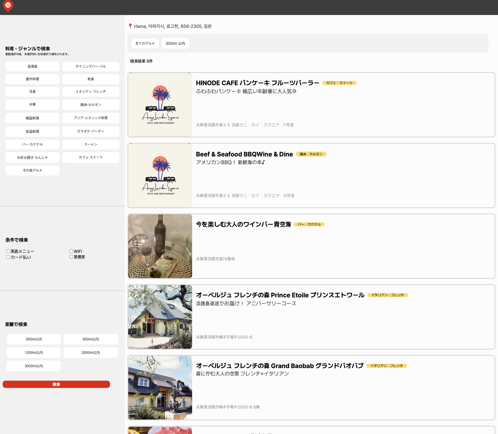
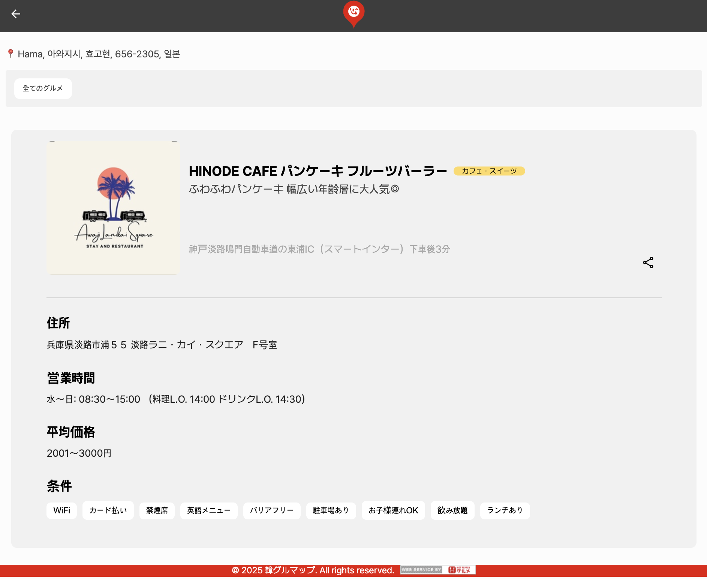

# 📌 HotPepper Web APIを活用したレストラン検索プロジェクト

## 📖 概要

このプロジェクトは、**HotPepper Web API**を活用して、ユーザーの現在地を基にレストラン情報を検索し、詳細ページでレストラン情報を共有できるように開発されました。

---

## 🚀 主な機能

### ✅ 1. 位置情報を活用したレストラン検索

- **Geolocation API** を利用して、ユーザーの現在地を取得
- 検索範囲（300m～3000m）を選択可能
- WiFi、クレジットカード決済可、禁煙席などのオプションを選択して検索

### ✅ 2. 検索結果の表示（リスト & 詳細情報）

- APIから取得した**レストランリスト**をUIに表示
- 各レストランカードをクリックすると、詳細情報を閲覧可能
- *詳細ページでレストラン情報を共有（スクリーンショット保存機能付き）*

### ✅ 3. ページネーション機能

- APIから提供される `results_available` の値を基に**ページネーション**を適用
- ページ遷移時も検索結果を保持

### ✅ 4. レストラン詳細情報 & 共有機能

- **`html2canvas`** を活用して、現在のページを**画像として保存**可能
- **Twitter共有機能**を追加し、レストラン情報を友達と共有可能

---

## 🔗 API情報

- **HotPepper Web API**: [公式ドキュメント](https://webservice.recruit.co.jp/doc/hotpepper/reference.html)
- **Geolocation API**: ユーザーの現在地を取得する機能を含む
- **GitHubリポジトリ**: [プロジェクトリポジトリ](https://github.com/gkdud3579/kangurumap)

---

## 🎯 対応OS・ブラウザ

- OS: Windows, macOS（モバイル版は後日対応予定）
- ブラウザ: Google Chrome（最新版推奨）

## ⚙️ 開発環境・使用ツール

- **開発環境**: Visual Studio Code (VSCode)
- **使用ツール**: Node.js, Vite, GitHub, ESLint, Sass

---

## 🏗️ 開発言語 & フレームワーク

### 🗂️ フロントエンド

- React: **^19.0.0**
- React Router: **^7.2.0**
- Vite: **^6.2.0**
- Sass: **^1.85.1**
- HTML5 / CSS3 / JavaScript (ES6+)

### 📦 その他ライブラリ

- `html2canvas` (**^1.4.1**) - スクリーンショット機能
- `SweetAlert2` (**^11.17.2**) - ユーザー通知アラート

---

## 🛠️ プロジェクトのセットアップ

### 1️⃣ **リポジトリのクローン**

```
git clone https://github.com/gkdud3579/kangurumap.git
cd kangurumap

```

### 2️⃣ **環境変数の設定 (`.env` ファイルの作成)**

```

VITE_HOTPEPPER_API_KEY=your_hotpepper_api_key
VITE_API_BASE_URL=https://webservice.recruit.co.jp/hotpepper/gourmet/v1/

```

### 3️⃣ **依存パッケージのインストールと実行**

```
npm install
npm run dev

```

---

## 📸 スクリーンショット（機能プレビュー）

| **ホーム画面** | **検索結果ページ** | **レストラン詳細ページ** |
|-------------|------------------|------------------|
|  |  |  |

---

## 🌐 APIリクエスト例

### 🔍 レストラン検索API (GETリクエスト)

```
https://webservice.recruit.co.jp/hotpepper/gourmet/v1/?key={API_KEY}&lat={LAT}&lng={LNG}&range={RANGE}&genre={GENRE}&wifi=あり&format=json

```

- **パラメータの説明**
    - `lat`, `lng`: 検索する位置の緯度/経度
    - `range`: 検索範囲（1〜5）
    - `genre`: レストランのジャンルコード
    - `wifi`: WiFiの提供有無（あり）
    - `format`: レスポンス形式（JSON）

---

## ⚠️ 注意事項

- **HotPepper APIの1日のリクエスト制限** があるため、テスト時は注意が必要です。
- **Geolocation API** の使用には、**ユーザーの位置情報の許可** が必要です。
- **html2canvasのスクリーンショット機能** は、一部のモバイルブラウザでは制限される可能性があります。

---

## 📂 プロジェクト構成

```
📂 src
 ┣ 📂 components  # UIコンポーネント
 ┣ 📂 hooks       # カスタムフック（API呼び出し、位置情報取得など）
 ┣ 📂 pages       # ルートページ（ホーム、検索結果、詳細）
 ┣ 📂 styles      # スタイリング（SCSS）
 ┣ 📜 App.jsx     # ルートコンポーネント
 ┗ 📜 main.jsx    # Reactエントリーファイル

```

---

## 🎯 コンセプト

日本を訪れる**韓国人観光客向け**の現地レストラン検索ウェブアプリです。

現在地を基に、近くの人気レストランを探せる機能を提供します。

### 📝 こだわった点

- 韓国人観光客が日本で役立つ機能を考慮し、オプション機能を追加
- ホーム画面に戻らず、検索結果画面から直接再検索が可能

### 🎨 デザインのこだわり

- 日本の「日の丸」の赤を基調とし、食欲を刺激する赤色をUIに活用

### 💡 技術的なフィードバックが欲しい点

✔ **レスポンシブウェブデザイン** を考慮した設計方法と実装ステップについてのアドバイスが欲しい

✔ **UI/UX最適化** のため、px → rem, em, % に変換する適切な方法を知りたい

✔ **APIリクエストの最適化** と、より効率的な状態管理の方法についてのフィードバックが欲しい

---

## 📌 自己評価

### **オープンAPI活用の経験**

- 今までバックエンド開発者と共同で作成したAPIを使用する経験はありましたが、**HotPepper APIを直接活用するのは初めて** でした。そのため、API構造の分析と、それに応じた通信処理の学習ができました。
- **サーバーを使わず、フロントエンドのみでAPIを活用する方法** について深く考える機会になりました。

### **課題点**

- **レスポンシブデザイン未対応** が最大の課題です。
- **設計段階でマルチデバイス対応を考慮する方法** を学びたいです。

### **今後の改善点**

- レスポンシブ設計を考慮した開発プロセスを研究し、より最適なUXを提供できるようにしたいです。
- **API活用の最適化** に向けた改善を継続的に行いたいと考えています。

## 🐞 現在確認しているバグと対策
現在発生しているバグとその対応策についてまとめました。  
詳細はGitHubのIssueをご確認ください。

[🔗 バグと対策の詳細を見る](https://github.com/gkdud3579/kangurumap/issues/8)

## 🔧 今後追加したい機能
- 🔹 **検索結果の最上部にスポンサー機能を追加**
  - スポンサー広告やおすすめの店舗を検索結果の最上部に表示できるようにする
- 🔹 **住所クリックでマップに連携**
  - 検索されたレストランの住所をクリックすると、Googleマップやネイティブの地図アプリに連携する
- 🔹 **類似カテゴリーの周辺飲食店を推薦**
  - 同じジャンル（例: 居酒屋、ラーメン、カフェ）の近隣の飲食店を推薦する機能を追加


---


# 📌 HotPepper Web API 활용 레스토랑 검색 프로젝트

## 📖 개요

이 프로젝트는 **HotPepper Web API**를 활용하여 사용자의 현재 위치를 기반으로 레스토랑 정보를 검색하고, 상세 페이지에서 레스토랑 정보를 공유할 수 있도록 개발되었습니다.

---

## 🚀 주요 기능

### ✅ 1. 위치 기반 레스토랑 검색

- **Geolocation API**를 활용하여 사용자의 현재 위치를 가져옵니다.
- 검색 반경(300m ~ 3000m)을 선택하여 범위를 설정할 수 있습니다.
- 선택한 옵션(WiFi, 카드 결제 가능, 금연석 등)과 함께 검색이 가능합니다.

### ✅ 2. 검색 결과 표시 (리스트 & 상세 정보)

- API를 통해 받아온 **레스토랑 리스트**를 UI에 표시합니다.
- 각 레스토랑 카드를 클릭하면 상세 정보를 볼 수 있습니다.
- *상세 페이지에서 레스토랑 정보를 공유(스크린샷 다운로드 기능 포함)**할 수 있습니다.

### ✅ 3. 페이징 기능

- API에서 제공하는 `results_available` 값을 기반으로 **페이지네이션**을 적용했습니다.
- 페이지 이동 시 기존 검색 결과가 유지됩니다.

### ✅ 4. 레스토랑 상세 정보 & 공유 기능

- 상세 페이지에서 `html2canvas`를 활용해 현재 페이지를 **이미지로 저장할 수 있습니다.**
- **트위터 공유 기능**을 추가하여 해당 레스토랑 정보를 친구들과 공유할 수 있습니다.

---

## 🔗 API 정보

- **HotPepper Web API**: [공식 문서 바로가기](https://webservice.recruit.co.jp/doc/hotpepper/reference.html)
- **Geolocation API**: 사용자의 현재 위치를 가져오는 기능을 포함합니다.
- **GitHub Repository**: [프로젝트 저장소](https://github.com/gkdud3579/kangurumap)

---

## 대상 OS 및 브라우저
- OS: Windows, macOS (모바일버전 추후 제작예정)
- 브라우저: Google Chrome (최신 버전)
## ⚙️ 개발 환경 / 사용 툴
- 개발 환경: Visual Studio Code (VSCode)
- 사용 툴: Node.js, Vite, GitHub, ESLint, Sass

---

## 개발 언어 & 프레임워크
### 🗂️ 프론트엔드
- React: ^19.0.0
- React Router: ^7.2.0
- Vite: ^6.2.0
- Sass: ^1.85.1
- HTML5 / CSS3 / JavaScript (ES6+)
### 📦 기타 라이브러리
- html2canvas (^1.4.1) - 스크린샷 기능 구현
- SweetAlert2 (^11.17.2) - 사용자 알림 메시지 처리

---

## 🛠️ 프로젝트 실행 방법

### 1️⃣ **프로젝트 클론**

```bash
git clone https://github.com/gkdud3579/kangurumap.git
cd kangurumap
cd kangrumap

```

### **환경 변수 설정 (`.env` 파일 생성)**

```
VITE_HOTPEPPER_API_KEY=your_hotpepper_api_key
VITE_API_BASE_URL=https://webservice.recruit.co.jp/hotpepper/gourmet/v1/

```

### 3️⃣ **의존성 설치 및 실행**

```
npm install
npm run dev

```

## 📸 스크린샷 (기능 미리보기)
| **홈 화면** | **검색 결과 페이지** | **레스토랑 상세 페이지** |
|-------------|------------------|------------------|
|  |  |  |

## API 요청 예시

### 🔍 레스토랑 검색 API (GET 요청)

```
https://webservice.recruit.co.jp/hotpepper/gourmet/v1/?key={API_KEY}&lat={LAT}&lng={LNG}&range={RANGE}&genre={GENRE}&wifi=あり&format=json

```

- **파라미터 설명**
    - `lat`, `lng`: 검색할 위치의 위도/경도
    - `range`: 검색 반경 (1~5)
    - `genre`: 음식점 장르 코드
    - `wifi`: WiFi 제공 여부 (あり)
    - `format`: 응답 형식 (JSON)

---

## ⚠️ 유의 사항

- *HotPepper API의 일일 호출 제한(쿼터 제한)**이 있으므로 **테스트 시 주의가 필요합니다.**
- Geolocation API는 **사용자 브라우저의 위치 권한 허용이 필요합니다.**
- 모바일 브라우저에서 html2canvas의 스크린샷 캡처 기능이 일부 제한될 수 있습니다.

---

## 🏗️ 프로젝트 구조

```
📂 src
 ┣ 📂 components  # UI 컴포넌트
 ┣ 📂 hooks       # 커스텀 훅 (API 호출, 위치 가져오기 등)
 ┣ 📂 pages       # 라우트 페이지 (홈, 검색결과, 상세)
 ┣ 📂 styles      # 스타일링 (SCSS)
 ┣ 📜 App.jsx     # 루트 컴포넌트
 ┗ 📜 main.jsx    # React 엔트리 파일
 ```

---

## 🎯 컨셉
日本(일본)을 방문한 韓国人(한국인) 관광객을 위한 현지 맛집 검색 웹앱입니다. 
현위치 기반 검색으로 사용자의 현재 위치에서 가까운 맛집 추천 기능을 제공합니다.
### 📝 신경 쓴 부분
한국인 관광객이 일본에서 필요한 기능을 고려하여 옵션기능을 추가하였습니다. 
홈 화면으로 돌아가지 않고 리스트 화면에서 바로 재 검색이 가능하도록 구현하였습니다.
### 🎨 디자인 면에서 신경 쓴 부분
日本(일본)의 '日の丸' 레드 컬러를 활용하여 디자인을 사용하였습니다.
식욕을 돋우는 레드 컬러를 UI 주요 색상으로 사용하였습니다.
### 💡 기술적인 측면에서 피드백 받고 싶은 부분
✔ 반응형 웹 디자인을 고려한 기획방법과 구현 하는 단계를 조언받고 싶습니다.
✔ 다양한 디바이스에서 UI/UX 최적화를 위한 px을 Rem이나 em 혹은 %로 변환하시는 방법이 궁금합니다.
✔ API 요청 최적화 및 효율적인 상태 관리를 하는 방법에 대한 조언을 받고 싶습니다.

## 📌 자기 평가
### 오픈 API 활용 경험

- 기존에 백엔드 개발자와 협업하며 함께 제작한 서버를 연결하기 위해 API를 사용했지만, Hotpepper API를 직접 활용하는 것은 처음이여서 해당 API 구조를 분석하고 그에 맞게 통신하는 것에 대한 많은 공부가 되었습니다.
- 서버 없이 프론트엔드에서 API만 활용하는 방식에 대해 깊이 고민할 수 있는 좋은 시간이었습니다. 

### 아쉬운 점

- 반응형 웹 어플리케이션으로 제작되지 못한 것이 가장 아쉬운 부분입니다.
- 기획 단계에서 다양한 디바이스 대응을 고려하는 방법을 배우고 싶습니다. 

### 향후 개선 방향

- 반응형 웹을 고려한 기획 및 개발의 필요성을 많이 느끼고 그 쪽에 대한 고민을 더 할 예정입니다.
- 서버 없이 API를 활용하는 방식에서 더 최적화된 구조 탐색 공부가 더 필요하다고 생각했습니다.

## 🐞 현재 파악하고 있는 버그와 대책
현재 발생하고 있는 버그와 그에 대한 해결 방안을 정리하였습니다.  
자세한 내용은 GitHub 이슈에서 확인할 수 있습니다.

[🔗 버그 및 대책 확인하기](https://github.com/gkdud3579/kangurumap/issues/8)

## 🔧 추후 추가하고 싶은 기능
- 🔹 **검색결과 맨 상단 스폰서 기능 추가**
  - 스폰서 광고 또는 추천 가게를 검색 결과의 최상단에 배치할 수 있도록 구현
- 🔹 **주소 클릭 시 지도 연결**
  - 검색된 레스토랑의 주소를 클릭하면 Google Maps 또는 네이티브 지도 앱과 연동
- 🔹 **비슷한 카테고리의 주변 음식점 추천**
  - 같은 장르(예: 이자카야, 라멘, 카페)의 인근 음식점을 추천하는 기능 추가


